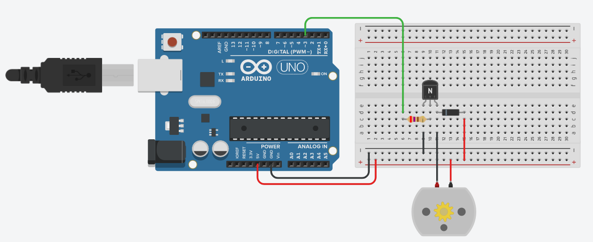

# Simulação do circuito

### Instruções

Elaborar as seguintes funções, para a plataforma Arduino. A seguir, implementar em alguma aplicação. Pode ser em circuito físico ou simulador (por exemplo piscar um LED).

* delay_ms(parametro) - efetua uma pausa no programa de acordo com o parâmetro dado em milisegundos
* delay_s(parametro) - efetua uma pausa no programa de acordo com o parâmetro dado em segundos

### Montagem do circuito

[Clique aqui para executar simulação](https://www.tinkercad.com/things/gXuz68ss7pc)

### Breve explicação

O motor DC gira numa certa velocidade durante um certo tempo determinado pelo programador passado por parâmetro na função `delay_ms(param)`.
Depois a velocidade do motor é reduzida e continua girando até o tempo passado por parâmetro na função `delay_s(param)` acabar.
Após isso o motor para de girar e permanece assim pelo tempo determinado na função `delay_ms(param)`. E o ciclo continua.

