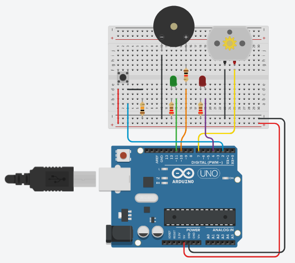

# Simulação do circuito

### Instruções

Implementar um sistema executivo cíclico em Arduino, usando temporizador sem bloqueio (não usar função delay(), usar smart delay) contendo três tarefas de livre escolha, uma tarefa obrigatória, e uma tarefa a ser desempenhada através de uma interrupção, de acordo com o modelo abordado nas aulas. Cada tarefa deve ter um período específico diferente dos demais.

### Montagem do circuito

[Clique aqui para executar simulação](https://www.tinkercad.com/things/bDClox4x84D?sharecode=njZUcLxXm3IQSfF-h9S_ioxP6Chrw0FKcdQP9vhDtXE)

### Breve explicação

