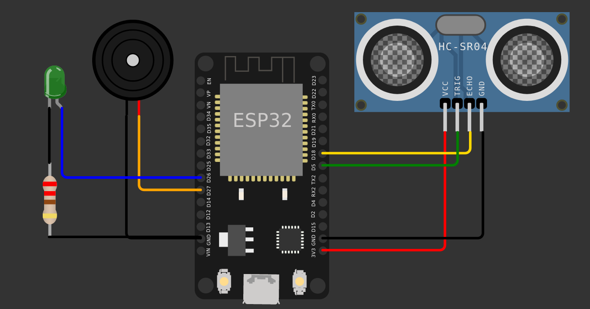

# Tecnologia para a Inclusão: Desenvolvimento de um dispositivo assistivo com a plataforma Arduino para pessoas com deficiência visual

## Descrição do projeto

Este projeto apresenta a implementação de um dispositivo assistivo baseado em Arduino para pessoas com deficiência visual, incorporando sensores e atuadores . O sistema visa melhorar a mobilidade e autonomia dos usuários ao fornecer informações e orientação em ambientes no dia a dia dos usuários, utilizando sensores para detecção de obstáculos e atuadores para feedbacks auditivos. A abordagem robótica resulta em um dispositivo adaptável, com interface de fácil interação para as necessidades individuais dos usuários. A proposta visa promover a independência e a inclusão, aprimorando a qualidade de vida das pessoas com deficiência visual por meio de tecnologias assistivas acessíveis e personalizadas.

## Materiais

|         Componente          | Quantidade |
| :-------------------------: | :--------: |
|         Arduino Uno         |     1      |
| Sensor ultrassônico HC-SR04 |     1      |
|           Buzzer            |     1      |
|        Resistor 220Ω        |     1      |
|          Led Verde          |     1      |
|  Software Wokwi(simulação)  |     1      |

## Circuito

## Como executar

1. Circuito físico:

Para executar o código, basta abrir o arquivo `main.ino` no Arduino IDE e fazer o upload para a placa.
Troque o valor da definição da constantes `WIFI_SSID` e `WIFI_PASS` para o nome e senha da sua rede wi-fi.

2. Simulação:
Acesse o link da [simulação](https://wokwi.com/projects/370972704596368385) e clique no botão de play.

## Breve explicação do código

O código é dividido em 3 partes principais:

1. Configuração do dispositivo: onde são inicializados os componentes e configuradas as comunicações serial e wi-fi usando as funções `setup()` e `init[nome da configuração]()`.
2. Criação de funções auxiliares: onde são criadas funções para facilitar a leitura dos sensores e atuação dos atuadores.
3. Criação das tarefas usando a biblioteca do freeRTOS: onde são criadas as tarefas que serão executadas em paralelo.
   - `TaskReadSensorData()`: lê o sensor ultrassônico e envia a distância lida para a fila.
   - `TaskBuzzer()`: lê a fila e atua o buzzer de acordo com a distância lida. Se menor que `limitDistance` o buzzer atua intermitentemente até alcançar uma distância maior que `limitDistance`.
   - `TaskLed()`: atua o led a cada segundo para indicar que o dispositivo está funcionando.

## Referências